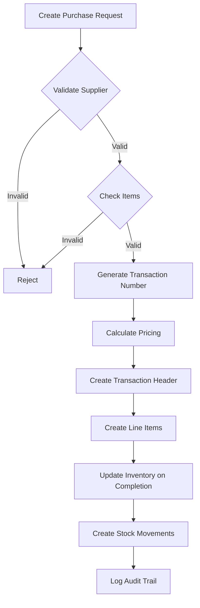
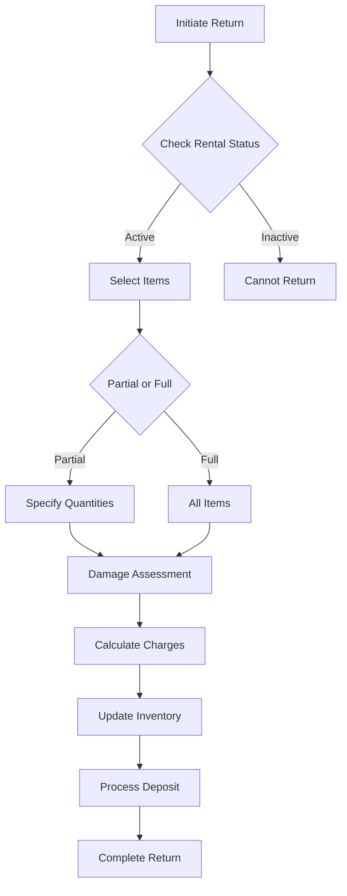

# Rental Management System - Comprehensive Business Rules Documentation

## Table of Contents
1. [Executive Summary](#executive-summary)
2. [Transaction Business Rules](#transaction-business-rules)
3. [Inventory Management Rules](#inventory-management-rules)
4. [Rental Business Rules](#rental-business-rules)
5. [Purchase Business Rules](#purchase-business-rules)
6. [Sales Business Rules](#sales-business-rules)
7. [Financial Control Rules](#financial-control-rules)
8. [Data Validation Rules](#data-validation-rules)
9. [User Authentication & Authorization Rules](#user-authentication--authorization-rules)
10. [Audit & Compliance Rules](#audit--compliance-rules)

---

## Executive Summary

This document provides a comprehensive overview of all business rules implemented in the Rental Management System. The system enforces these rules through multiple layers:
- **Database constraints** for data integrity
- **Backend validation** in FastAPI services
- **Frontend validation** in React components
- **Workflow orchestration** across transaction lifecycles

### Key Business Rule Categories:
1. **Transaction Management** - Governs all business transactions (purchases, sales, rentals, returns)
2. **Inventory Control** - Manages stock levels, movements, and availability
3. **Financial Processing** - Handles pricing, payments, taxes, and deposits
4. **Compliance & Audit** - Ensures regulatory compliance and maintains audit trails

---

## Transaction Business Rules

### 1. Transaction Lifecycle Management

#### Rule Definition:
All transactions must follow a defined state machine with controlled transitions.

#### Implementation:
- **Backend**: `/rental-manager-api/app/models/transaction.py`
- **Service Layer**: `/rental-manager-api/app/services/transaction/transaction_service.py`

#### State Transitions:
```
PENDING → PROCESSING → COMPLETED
PENDING → CANCELLED
PROCESSING → ON_HOLD → PROCESSING
PROCESSING → CANCELLED
ON_HOLD → CANCELLED
```

#### Business Logic:
- Transactions can only move forward in the lifecycle unless being cancelled
- Once COMPLETED, a transaction cannot be modified (immutable)
- ON_HOLD status requires manual intervention to resume
- Cancellation triggers automatic inventory restoration

#### Example:
```python
# Purchase transaction lifecycle
purchase = create_purchase(status="PENDING")
# Validate supplier credit → Move to PROCESSING
# Receive goods → Update inventory → Move to COMPLETED
# If issues found → Move to ON_HOLD for review
```

#### Data Flow:
1. Transaction created with PENDING status
2. Validation checks trigger status updates
3. Status changes logged in transaction_events table
4. Inventory updates triggered by status transitions
5. Financial entries created on COMPLETED status

### 2. Transaction Numbering System

#### Rule Definition:
Each transaction must have a unique, sequential number following the format: `{TYPE}-{YYYY}-{MM}-{SEQUENCE}`

#### Implementation:
- **Backend**: `/rental-manager-api/app/services/transaction/transaction_service.py:124`

#### Business Logic:
- Numbers are generated automatically and cannot be modified
- Sequence resets monthly (not yearly)
- Each transaction type has its own sequence
- Format ensures chronological sorting and type identification

#### Examples:
- `PUR-2024-01-000001` - First purchase in January 2024
- `SAL-2024-01-000002` - Second sale in January 2024
- `RNT-2024-02-000001` - First rental in February 2024
- `RET-2024-02-000003` - Third return in February 2024

#### Validation Constraints:
- Must be unique within database
- Cannot be manually assigned
- Cannot be changed after creation
- Must follow exact format pattern

---

## Inventory Management Rules

### 3. Serial Number Uniqueness

#### Rule Definition:
Serialized items must have globally unique serial numbers across the entire system.

#### Implementation:
- **Database Constraint**: `idx_inventory_units_serial_unique`
- **Backend Validation**: `/rental-manager-api/app/schemas/transaction/purchase.py:38-53`
- **API Endpoint**: `GET /api/inventory/validation/serial-numbers/{serial_number}/check`

#### Business Logic:
- Serial numbers are validated before purchase creation
- Duplicate serial numbers are rejected at database level
- Batch validation available for bulk operations
- Real-time validation available via API

#### Example:
```python
# Validation during purchase
serial_numbers = ["SN001", "SN002", "SN003"]
for serial in serial_numbers:
    if serial_exists(serial):
        raise ValidationError(f"Serial number {serial} already exists")
```

#### Data Flow:
1. Serial number entered in purchase form
2. Frontend calls validation API
3. Backend checks database constraint
4. Result returned to user immediately
5. Purchase blocked if duplicate found

### 4. Quantity Rules for Serialized Items

#### Rule Definition:
Serialized items must have quantity = 1 per inventory unit, with serial number count matching total quantity.

#### Implementation:
- **Database Constraint**: `check_serialized_quantity`
- **Backend**: `/rental-manager-api/app/schemas/transaction/purchase.py:55-67`

#### Business Logic:
```python
if item.serial_numbers:
    if len(item.serial_numbers) != int(item.quantity):
        raise ValueError(f'Serial numbers count must match quantity')
    # Each serial creates individual inventory unit with qty=1
```

#### Validation Constraints:
- Serialized items cannot have quantity > 1 per unit
- Serial number list length must equal total quantity
- Non-serialized items cannot have serial numbers

### 5. Batch Tracking for Non-Serialized Items

#### Rule Definition:
Non-serialized items use batch codes for tracking, with automatic generation if not provided.

#### Implementation:
- **Backend**: `/rental-manager-leg/rental-manager-backend/BUSINESS_RULES_TEST_RESULTS.md:35-36`

#### Business Logic:
- Batch codes must be unique across system
- Format: `BATCH-{YYYY}{MM}{DD}-{SEQUENCE}`
- Mutually exclusive with serial numbers
- Used for expiry tracking and quality control

#### Example:
```python
if not item.serial_numbers and not item.batch_code:
    item.batch_code = generate_batch_code()  # BATCH-20240115-001
```

### 6. Stock Movement Tracking

#### Rule Definition:
Every inventory change must create an immutable stock movement record with complete audit trail.

#### Implementation:
- **Backend**: `/rental-manager-api/app/services/inventory/inventory_service.py`

#### Movement Types:
- **PURCHASE** - Increases stock
- **SALE** - Decreases stock  
- **RENTAL_PICKUP** - Allocates stock
- **RENTAL_RETURN** - Deallocates stock
- **ADJUSTMENT** - Manual correction
- **TRANSFER** - Location change
- **DAMAGE** - Write-off
- **RETURN** - Customer/supplier returns

#### Data Flow:
1. Transaction triggers inventory change
2. Stock level updated atomically
3. Movement record created with:
   - Transaction reference
   - Quantity changed
   - Before/after values
   - User and timestamp
4. Movement records are immutable

---

## Rental Business Rules

### 7. Rental Lifecycle Management

#### Rule Definition:
Rentals follow a complex state machine with business rules at each transition.

#### Implementation:
- **Backend**: `/rental-manager-api/app/services/transaction/rental_service.py:61-199`

#### State Machine:
```
PENDING_PICKUP → ACTIVE → COMPLETED
              ↓        ↓
           OVERDUE  PARTIAL_RETURN
              ↓        ↓
          LATE_FEE  EXTENDED
```

#### Business Logic:
- **PENDING_PICKUP**: Reservation made, awaiting collection
- **ACTIVE**: Items collected, rental in progress
- **OVERDUE**: Past due date, late fees accumulating
- **PARTIAL_RETURN**: Some items returned, others still out
- **COMPLETED**: All items returned, deposits settled

### 8. Rental Pricing Calculation

#### Rule Definition:
Rental pricing follows configurable strategies with automatic discounts based on duration.

#### Implementation:
- **Backend Constants**: `/rental-manager-api/app/services/transaction/rental_service.py:65-69`

#### Pricing Formula:
```python
def calculate_rental_price(item, duration, period_unit):
    base_rates = {
        'HOUR': item.hourly_rate,
        'DAY': item.daily_rate,
        'WEEK': item.weekly_rate,
        'MONTH': item.monthly_rate
    }
    
    # Duration-based discounts
    if period_unit == 'DAY' and duration >= 7:
        rate *= 0.9  # 10% discount
    elif period_unit == 'DAY' and duration >= 30:
        rate *= 0.8  # 20% discount
    
    rental_charge = base_rate * duration
    security_deposit = item.replacement_value * 0.2  # 20% deposit
    
    return {
        'rental': rental_charge,
        'deposit': security_deposit,
        'total': rental_charge + security_deposit
    }
```

#### Business Constants:
- **Security Deposit**: 20% of item replacement value
- **Minimum Rental**: 4 hours
- **Maximum Extensions**: 3 per rental
- **Grace Period**: 1 day before late fees

### 9. Late Fee Calculation

#### Rule Definition:
Late fees apply after grace period at 150% of daily rate, capped at security deposit.

#### Implementation:
- **Backend**: `/rental-manager-backup-20250822_204932/rental-manager-api/TRANSACTION_BUSINESS_RULES.md:201-222`

#### Formula:
```python
def calculate_late_fee(rental):
    days_late = (today - rental.end_date).days
    
    if days_late <= GRACE_PERIOD_DAYS:  # 1 day grace
        return 0
    
    daily_rate = rental.daily_rate
    late_fee_multiplier = 1.5  # 150% of daily rate
    
    late_fee = days_late * daily_rate * late_fee_multiplier
    
    # Cap at security deposit
    return min(late_fee, rental.security_deposit)
```

### 10. Damage Assessment Rules

#### Rule Definition:
Returned items are assessed for damage with standardized categories affecting deposit returns.

#### Implementation:
- **Backend**: `/rental-manager-backup-20250822_204932/rental-manager-api/TRANSACTION_BUSINESS_RULES.md:224-252`

#### Damage Categories:
| Category | Condition | Deposit Return | Action |
|----------|-----------|----------------|--------|
| A | Like new | 100% | Return to inventory |
| B | Minor wear | 90% | Return to inventory |
| C | Repairable damage | 50% | Send to repair |
| D | Major damage | 0% | Assess for write-off |
| E | Total loss | -100% (charge replacement) | Write off |

#### Damage Charge Calculation:
```python
def calculate_damage_charge(item, damage_category, repair_cost=0):
    charges = {
        'A': 0,
        'B': item.security_deposit * 0.1,
        'C': item.security_deposit * 0.5,
        'D': item.security_deposit,
        'E': item.replacement_value
    }
    
    total = max(charges[damage_category], repair_cost)
    return min(total, item.replacement_value)
```

### 11. Rental Return Processing

#### Rule Definition:
Returns allow partial quantities with specific rules for late items and damage assessment.

#### Implementation:
- **Frontend**: `/rental-manager-frontend/src/components/rentals/ReturnItemsTable.tsx`

#### Business Logic:
- **Partial Return**: Only available when quantity ≥ 2
- **Late Return**: Automatically flagged past due date
- **Damage Notes**: Required for condition C, D, E
- **Quantity Validation**: Cannot return more than rented

#### Example Flow:
1. Select items to return
2. Specify return action (COMPLETE/PARTIAL/DAMAGED)
3. Enter return quantity (for partial)
4. Add damage notes if applicable
5. Calculate financial impact
6. Update inventory status

---

## Purchase Business Rules

### 12. Purchase Validation Rules

#### Rule Definition:
Purchases require comprehensive validation of supplier, items, quantities, and pricing.

#### Implementation:
- **Frontend**: `/rental-manager-frontend/src/lib/purchase-validation.ts:35-144`
- **Backend**: `/rental-manager-api/app/schemas/transaction/purchase.py:14-121`

#### Validation Rules:
```typescript
// Quantity constraints
MIN_QUANTITY = 1
MAX_QUANTITY = 10000

// Price constraints  
MIN_UNIT_COST = 0.01
MAX_UNIT_COST = 1000000

// Item limits
MAX_PURCHASE_ITEMS = 50
```

#### Business Constraints:
- Active supplier required
- At least one line item
- Purchase date cannot be future
- Quantities must be positive
- Serial numbers must be unique
- Batch codes exclusive with serials

### 13. Supplier Credit Management

#### Rule Definition:
Supplier credit limits are enforced with automatic holds for exceeded limits.

#### Implementation:
- **Frontend Validation**: `/rental-manager-frontend/src/lib/purchase-validation.ts:124-137`

#### Business Logic:
```typescript
if (supplier.supplier_tier === 'RESTRICTED') {
    warnings.push('Supplier has restricted status');
}

if (supplier.payment_terms === 'PREPAID') {
    warnings.push('Prepaid terms - immediate payment required');
}

if (purchase_total > supplier.credit_limit) {
    errors.push('Purchase exceeds supplier credit limit');
}
```

### 14. Price Variance Detection

#### Rule Definition:
System warns when purchase prices vary significantly from base prices.

#### Implementation:
- **Frontend**: `/rental-manager-frontend/src/lib/purchase-validation.ts:100-107`

#### Threshold:
```typescript
const priceDifference = Math.abs(item.unit_cost - sku.sale_base_price) / sku.sale_base_price;
if (priceDifference > 0.5) { // 50% variance
    warnings.push('Unit cost varies significantly from base price');
}
```

### 15. Purchase Return Rules

#### Rule Definition:
Returns must reference original purchase with quantity and date validations.

#### Implementation:
- **Frontend**: `/rental-manager-frontend/src/lib/purchase-validation.ts:146-255`

#### Validation:
- Return date ≥ purchase date
- Return quantity ≤ original quantity
- Return amount ≤ original amount
- Condition downgrade affects refund

#### Refund Calculation:
```typescript
// Refund rates by return reason
DEFECTIVE: 100%
WRONG_ITEM: 100%
QUALITY_ISSUE: 90%
OVERSTOCKED: 85% (restocking fee)
OTHER: 80%

// Additional reduction for condition downgrade
if (condition_downgraded) {
    refund_rate *= 0.8; // 20% reduction
}
```

---

## Sales Business Rules

### 16. Stock Availability Check

#### Rule Definition:
Sales transactions verify real-time stock availability considering reservations and allocations.

#### Implementation:
- **Backend**: `/rental-manager-backup-20250822_204932/rental-manager-api/TRANSACTION_BUSINESS_RULES.md:122-137`

#### Availability Formula:
```python
available_qty = (
    stock_level.quantity_on_hand
    - stock_level.quantity_reserved  # Pending orders
    - stock_level.quantity_allocated  # Active rentals
)

if item.allow_backorder:
    return True  # Negative stock allowed
    
return available_qty >= requested_qty
```

### 17. Customer Credit Validation

#### Rule Definition:
Credit sales require customer credit check with automatic holds for exceeded limits.

#### Implementation:
- **Backend**: `/rental-manager-backup-20250822_204932/rental-manager-api/TRANSACTION_BUSINESS_RULES.md:115-119`

#### Validation Rules:
- Check customer active status
- Verify credit limit if credit sale
- Check payment history
- Apply credit hold if needed

### 18. Pricing Hierarchy

#### Rule Definition:
Sales prices determined by hierarchical rules from specific to general.

#### Implementation:
- **Backend**: `/rental-manager-backup-20250822_204932/rental-manager-api/TRANSACTION_BUSINESS_RULES.md:139-152`

#### Price Determination Order:
1. **Customer-specific pricing** - Individual negotiated rates
2. **Customer group pricing** - Bulk/wholesale rates
3. **Promotional pricing** - Active campaigns
4. **Quantity break pricing** - Volume discounts
5. **Standard list price** - Default pricing

#### Discount Rules:
- Line item discounts applied first
- Order-level discounts on subtotal
- Maximum discount requires authorization
- All discounts logged for audit

---

## Financial Control Rules

### 19. Payment Processing Rules

#### Rule Definition:
Payments follow strict status transitions with validation at each step.

#### Implementation:
- **Backend**: `/rental-manager-backup-20250822_204932/rental-manager-api/TRANSACTION_BUSINESS_RULES.md:374-381`

#### Payment Status Flow:
```
PENDING → PARTIAL → PAID
PENDING → PAID
PAID → REFUNDED (partial/full)
```

#### Business Logic:
- Partial payments tracked incrementally
- Overpayments create credit balance
- Refunds require authorization
- Payment methods validated per transaction type

### 20. Tax Calculation Rules

#### Rule Definition:
Taxes calculated based on location, item category, and customer exemptions.

#### Implementation:
- **Backend**: `/rental-manager-backup-20250822_204932/rental-manager-api/TRANSACTION_BUSINESS_RULES.md:390-396`

#### Tax Application:
```python
def calculate_tax(item, customer, location):
    base_tax_rate = location.tax_rate
    
    # Check exemptions
    if customer.tax_exempt:
        return 0
    
    if item.category in TAX_EXEMPT_CATEGORIES:
        return 0
    
    # Apply compound tax if applicable
    tax = item.amount * base_tax_rate
    if location.has_compound_tax:
        tax += item.amount * location.compound_tax_rate
    
    return tax
```

### 21. Currency and Rounding Rules

#### Rule Definition:
All monetary values stored with 2 decimal precision using banker's rounding.

#### Implementation:
- **Backend**: `/rental-manager-backup-20250822_204932/rental-manager-api/TRANSACTION_BUSINESS_RULES.md:37-41`

#### Rounding Method:
```python
from decimal import Decimal, ROUND_HALF_EVEN

def round_currency(amount):
    return Decimal(amount).quantize(
        Decimal('0.01'), 
        rounding=ROUND_HALF_EVEN  # Banker's rounding
    )
```

---

## Data Validation Rules

### 22. SKU Generation Rules

#### Rule Definition:
SKUs follow category-based format with automatic sequential generation.

#### Implementation:
- **Backend**: `/rental-manager-api/app/services/sku_generator.py`

#### Format:
```
{CATEGORY_CODE}-{5_DIGIT_SEQUENCE}
Example: ELEC-00001, FURN-00002
```

#### Business Logic:
- Category determines prefix
- Sequence unique per category
- Cannot be manually assigned
- Immutable after creation

### 23. Barcode Validation

#### Rule Definition:
Barcodes must follow standard format with length and character restrictions.

#### Implementation:
- **Frontend**: `/rental-manager-frontend/src/lib/purchase-validation.ts:370-373`

#### Validation:
```typescript
function validateBarcodeFormat(barcode: string): boolean {
    return /^[0-9A-Z\-]+$/.test(barcode) && 
           barcode.length >= 6 && 
           barcode.length <= 20;
}
```

### 24. Date Validation Rules

#### Rule Definition:
Transaction dates must follow logical chronology with business-specific constraints.

#### Implementation:
- **Frontend**: `/rental-manager-frontend/src/lib/purchase-validation.ts:46-61`

#### Date Rules:
- Purchase date ≤ today
- Return date ≥ purchase date
- Rental end ≥ rental start
- Delivery date ≥ order date
- Warning if date > 1 year old

### 25. Quantity Validation

#### Rule Definition:
Quantities must be within acceptable ranges based on transaction type.

#### Implementation:
- **Frontend**: `/rental-manager-frontend/src/lib/purchase-validation.ts:14-20`

#### Limits by Transaction Type:
| Transaction | Min Qty | Max Qty | Decimal Allowed |
|------------|---------|---------|-----------------|
| Purchase | 1 | 10,000 | Yes |
| Sale | 1 | 1,000 | Yes |
| Rental | 1 | 100 | No |
| Return | 1 | Original Qty | Yes |

---

## User Authentication & Authorization Rules

### 26. Password Security Rules

#### Rule Definition:
Passwords must meet complexity requirements with secure storage.

#### Implementation:
- **Backend**: Configuration in environment variables

#### Requirements:
- Minimum 8 characters
- Must include uppercase, lowercase, numbers, special characters
- Bcrypt hashing with 12 rounds
- No password reuse for last 5 passwords
- Expiry after 90 days (configurable)

### 27. JWT Token Management

#### Rule Definition:
JWT tokens have defined expiry with automatic refresh mechanism.

#### Implementation:
- **Backend**: `/rental-manager-api/app/core/security.py`
- **Frontend**: `/rental-manager-frontend/src/lib/token-manager.ts`

#### Token Rules:
- Access token: 30 minutes expiry
- Refresh token: 7 days expiry
- Automatic refresh on 401 response
- Secure storage in httpOnly cookies
- Token blacklist for logout

### 28. Role-Based Access Control (RBAC)

#### Rule Definition:
Users have roles with granular permissions for resource access.

#### Implementation:
- **Backend**: `/rental-manager-api/app/core/permissions.py`
- **Frontend**: `/rental-manager-frontend/src/stores/auth-store.ts`

#### Permission Structure:
```typescript
// Resource-based permissions
customers:read
customers:write
customers:delete

// Role aggregation
ADMIN: all permissions
MANAGER: read/write, no delete
OPERATOR: read only
```

---

## Audit & Compliance Rules

### 29. Transaction Audit Trail

#### Rule Definition:
Every transaction maintains complete audit trail with immutable history.

#### Implementation:
- **Backend**: `/rental-manager-backup-20250822_204932/rental-manager-api/TRANSACTION_BUSINESS_RULES.md:399-406`

#### Audit Requirements:
```python
# Required audit fields
- user_id: Who performed action
- timestamp: When action occurred
- operation: What was done
- before_value: Previous state
- after_value: New state
- ip_address: Origin of request
- session_id: User session
- reason: For critical changes
```

### 30. Data Retention Policies

#### Rule Definition:
Business data retained according to regulatory requirements.

#### Implementation:
- **Backend**: `/rental-manager-backup-20250822_204932/rental-manager-api/TRANSACTION_BUSINESS_RULES.md:407-411`

#### Retention Periods:
| Data Type | Retention Period | Archive Method |
|-----------|-----------------|----------------|
| Transactions | 7 years | Cold storage after 2 years |
| Audit Logs | 3 years | Compressed archives |
| Customer Data | 5 years after last activity | Anonymization available |
| Financial Records | 7 years | Immutable storage |

### 31. Compliance Controls

#### Rule Definition:
System enforces regulatory compliance through automated controls.

#### Implementation:
- **Backend**: Various service files

#### Key Controls:
- **Segregation of Duties**: Create vs approve separation
- **Approval Workflows**: High-value transactions need approval
- **Data Privacy**: PII encryption and access controls
- **Change Management**: All configuration changes logged

---

## Performance and System Rules

### 32. Response Time SLAs

#### Rule Definition:
System must meet defined performance targets.

#### Implementation:
- **Backend**: `/rental-manager-backup-20250822_204932/rental-manager-api/TRANSACTION_BUSINESS_RULES.md:421-425`

#### SLA Targets:
| Operation | Target Response Time |
|-----------|---------------------|
| Transaction Creation | < 100ms |
| Transaction Query | < 50ms |
| Report Generation | < 500ms per 1000 records |
| Bulk Operations | 100 transactions/second |

### 33. Concurrency Handling

#### Rule Definition:
System handles concurrent operations without data corruption.

#### Implementation:
- **Backend**: Database transaction isolation

#### Mechanisms:
- Optimistic locking for updates
- Queue management for bulk operations
- Deadlock detection and retry
- Connection pooling optimization

---

## Data Flow Examples

### Purchase Transaction Flow


### Rental Return Flow


---

## Implementation Best Practices

### 1. Multi-Layer Validation
- **Frontend**: Immediate user feedback
- **Backend API**: Request validation
- **Service Layer**: Business logic enforcement
- **Database**: Constraint enforcement

### 2. Error Handling Strategy
```python
try:
    # Business operation
    validate_business_rules()
    perform_operation()
except ValidationError as e:
    # Return user-friendly error
    return {"error": e.message, "code": "VALIDATION_ERROR"}
except BusinessRuleViolation as e:
    # Log and return specific error
    logger.error(f"Business rule violated: {e}")
    return {"error": "Operation violates business rules", "details": e.details}
```

### 3. Testing Business Rules
```python
# Test example for rental late fee calculation
def test_late_fee_calculation():
    rental = create_test_rental(
        end_date=date.today() - timedelta(days=3),
        daily_rate=100,
        security_deposit=500
    )
    
    late_fee = calculate_late_fee(rental)
    
    # 2 days late (1 day grace period)
    # Expected: 2 * 100 * 1.5 = 300
    assert late_fee == 300
    
    # Test cap at security deposit
    rental.end_date = date.today() - timedelta(days=10)
    late_fee = calculate_late_fee(rental)
    assert late_fee == 500  # Capped at deposit
```

---

## Conclusion

This comprehensive business rules documentation serves as the authoritative reference for the Rental Management System. All rules are enforced through a combination of:

1. **Preventive Controls**: Validation before operations
2. **Detective Controls**: Monitoring and alerts
3. **Corrective Controls**: Automated fixes and rollbacks

Regular review and updates of these business rules ensure the system maintains data integrity, regulatory compliance, and optimal business operations.

---

## Appendix: Quick Reference

### Critical Business Constants
```python
# Rental
GRACE_PERIOD_DAYS = 1
LATE_FEE_MULTIPLIER = 1.5
SECURITY_DEPOSIT_PERCENTAGE = 0.20
MIN_RENTAL_HOURS = 4
MAX_EXTENSION_COUNT = 3

# Purchase
MIN_QUANTITY = 1
MAX_QUANTITY = 10000
MIN_UNIT_COST = 0.01
MAX_UNIT_COST = 1000000
MAX_PURCHASE_ITEMS = 50

# Financial
TAX_DECIMAL_PLACES = 2
CURRENCY_DECIMAL_PLACES = 2
ROUNDING_METHOD = ROUND_HALF_EVEN

# System
MAX_TRANSACTION_AGE_WARNING = 365  # days
TOKEN_EXPIRY_MINUTES = 30
REFRESH_TOKEN_DAYS = 7
PASSWORD_MIN_LENGTH = 8
BCRYPT_ROUNDS = 12
```

### File Reference Map
| Business Domain | Backend Location | Frontend Location |
|----------------|------------------|-------------------|
| Transaction Core | `/app/services/transaction/` | `/src/services/api/transactions.ts` |
| Rental Management | `/app/services/transaction/rental_service.py` | `/src/components/rentals/` |
| Purchase Processing | `/app/services/transaction/purchase_service.py` | `/src/lib/purchase-validation.ts` |
| Inventory Control | `/app/services/inventory/` | `/src/stores/inventory-store.ts` |
| Financial Rules | `/app/models/transaction.py` | `/src/lib/currency-utils.ts` |
| Authentication | `/app/core/security.py` | `/src/stores/auth-store.ts` |
| Validation Schemas | `/app/schemas/` | `/src/lib/validations/` |

---

*Document Version: 1.0*  
*Last Updated: January 2025*  
*System Version: Rental Manager v5.0*