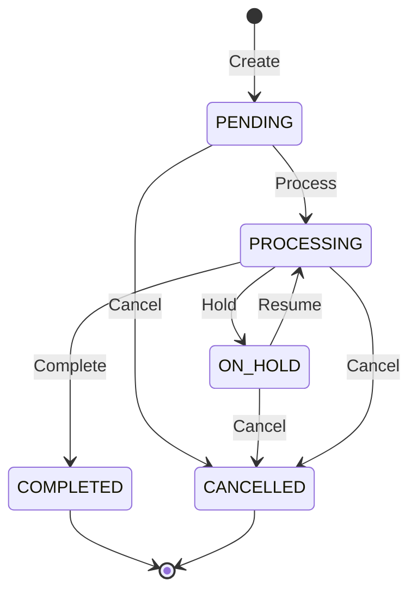
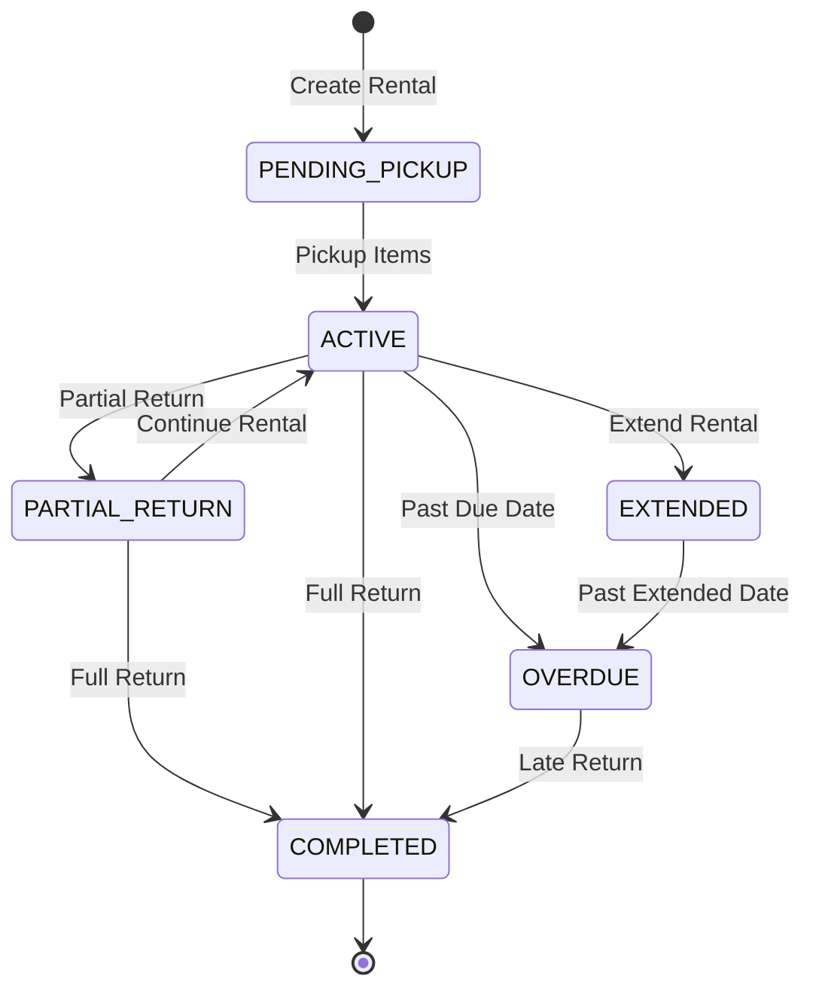

# Transaction Module Business Rules & Requirements

## Executive Summary
This document defines the comprehensive business rules, requirements, and workflows for the transaction module. These rules ensure data integrity, financial accuracy, and proper inventory management across all transaction types.

## 1. Core Transaction Rules

### 1.1 Transaction Lifecycle
All transactions follow a standard lifecycle with defined state transitions:



### 1.2 Transaction Numbering
- **Format**: `{TYPE}-{YYYY}-{MM}-{SEQUENCE}`
- **Examples**: 
  - `PUR-2024-01-000001` (Purchase)
  - `SAL-2024-01-000001` (Sale)
  - `RNT-2024-01-000001` (Rental)
  - `RET-2024-01-000001` (Return)
- **Rules**:
  - Numbers must be unique per type
  - Sequence resets monthly
  - Cannot be modified after creation

### 1.3 Financial Integrity
- All monetary values stored with 2 decimal precision
- Currency conversions logged with exchange rates
- Tax calculations based on location rules
- Rounding follows banker's rounding (round half to even)

## 2. Purchase Transaction Rules

### 2.1 Creation Requirements
**Mandatory Fields:**
- Supplier ID (must be active)
- Location ID (must be active)
- At least one line item
- Payment terms
- Expected delivery date

**Validation Rules:**
- Supplier credit limit check
- Item existence validation
- Quantity must be > 0
- Unit price must be >= 0
- Tax rate must be between 0-100%

### 2.2 Inventory Impact
**On Completion (COMPLETED status):**
```python
# Pseudocode for inventory update
for line_item in purchase.line_items:
    stock_level = get_stock_level(item_id, location_id)
    if stock_level exists:
        stock_level.quantity_on_hand += line_item.quantity
        stock_level.last_purchase_date = now()
        stock_level.last_purchase_price = line_item.unit_price
    else:
        create_stock_level(item_id, location_id, line_item.quantity)
    
    # Create stock movement record
    create_stock_movement(
        type="PURCHASE",
        quantity=line_item.quantity,
        reference=purchase.transaction_number
    )
    
    # Handle serialized items
    if item.is_serialized:
        for i in range(line_item.quantity):
            create_inventory_unit(
                item_id=item_id,
                serial_number=line_item.serial_numbers[i],
                status="AVAILABLE"
            )
```

### 2.3 Cost Calculation
**Landed Cost Formula:**
```
Landed Cost = (Unit Price * Quantity) + 
              (Shipping Cost / Total Items) + 
              (Import Duties) + 
              (Other Fees)
```

**Inventory Valuation Methods:**
- FIFO (First In, First Out)
- LIFO (Last In, First Out)
- Weighted Average Cost
- Specific Identification (for serialized items)

## 3. Sales Transaction Rules

### 3.1 Creation Requirements
**Mandatory Fields:**
- Customer ID (must be active)
- Location ID (stock location)
- At least one line item
- Payment method

**Validation Rules:**
- Customer credit check (if credit sale)
- Stock availability check
- Price list validation
- Discount authorization levels
- Minimum order quantity check

### 3.2 Stock Availability
**Availability Check Algorithm:**
```python
def check_availability(item_id, location_id, requested_qty):
    stock_level = get_stock_level(item_id, location_id)
    
    available_qty = (
        stock_level.quantity_on_hand
        - stock_level.quantity_reserved  # For pending orders
        - stock_level.quantity_allocated  # For rentals
    )
    
    if item.allow_backorder:
        return True  # Allow negative stock
    
    return available_qty >= requested_qty
```

### 3.3 Pricing Rules
**Price Determination Hierarchy:**
1. Customer-specific pricing
2. Customer group pricing
3. Promotional pricing (if active)
4. Quantity break pricing
5. Standard list price

**Discount Application:**
- Line item discounts applied first
- Order-level discounts applied to subtotal
- Maximum discount requires authorization
- Audit trail for all discounts

## 4. Rental Transaction Rules

### 4.1 Rental Lifecycle



### 4.2 Rental Pricing
**Rate Calculation:**
```python
def calculate_rental_price(item, duration, period_unit):
    base_rates = {
        'HOUR': item.hourly_rate,
        'DAY': item.daily_rate,
        'WEEK': item.weekly_rate,
        'MONTH': item.monthly_rate
    }
    
    base_rate = base_rates[period_unit]
    
    # Apply duration discounts
    if period_unit == 'DAY' and duration >= 7:
        base_rate *= 0.9  # 10% discount for week+
    elif period_unit == 'DAY' and duration >= 30:
        base_rate *= 0.8  # 20% discount for month+
    
    total_rental = base_rate * duration
    security_deposit = item.replacement_value * 0.2  # 20% deposit
    
    return {
        'rental_charge': total_rental,
        'security_deposit': security_deposit,
        'total_due': total_rental + security_deposit
    }
```

### 4.3 Late Fee Calculation
**Late Fee Formula:**
```python
def calculate_late_fee(rental):
    days_late = (today - rental.end_date).days
    
    if days_late <= 0:
        return 0
    
    # Grace period (configurable)
    if days_late <= GRACE_PERIOD_DAYS:
        return 0
    
    # Calculate fee
    daily_rate = rental.daily_rate
    late_fee_multiplier = 1.5  # 150% of daily rate
    
    late_fee = days_late * daily_rate * late_fee_multiplier
    
    # Cap at security deposit
    return min(late_fee, rental.security_deposit)
```

### 4.4 Damage Assessment
**Damage Categories:**
- **A**: Like new (100% deposit return)
- **B**: Minor wear (90% deposit return)
- **C**: Repairable damage (50% deposit return)
- **D**: Major damage (0% deposit return)
- **E**: Total loss (charge replacement cost)

**Damage Charge Calculation:**
```python
def calculate_damage_charge(item, damage_category, repair_cost=0):
    charges = {
        'A': 0,
        'B': item.security_deposit * 0.1,
        'C': item.security_deposit * 0.5,
        'D': item.security_deposit,
        'E': item.replacement_value
    }
    
    base_charge = charges[damage_category]
    
    # Add actual repair cost if provided
    if repair_cost > 0:
        total_charge = max(base_charge, repair_cost)
    else:
        total_charge = base_charge
    
    return min(total_charge, item.replacement_value)
```

## 5. Return Transaction Rules

### 5.1 Return Validation
**Eligibility Criteria:**
- Within return period (configurable, default 30 days)
- Original transaction must be COMPLETED
- Item condition acceptable
- Quantity <= original quantity
- Not previously returned

**Validation Process:**
```python
def validate_return(original_transaction_id, return_items):
    original = get_transaction(original_transaction_id)
    
    errors = []
    
    # Check time limit
    days_since_transaction = (today - original.date).days
    if days_since_transaction > RETURN_PERIOD_DAYS:
        errors.append("Return period expired")
    
    # Check each item
    for return_item in return_items:
        original_line = find_line_item(original, return_item.item_id)
        
        if not original_line:
            errors.append(f"Item {return_item.item_id} not in original transaction")
            continue
        
        already_returned = get_returned_quantity(original_line.id)
        returnable = original_line.quantity - already_returned
        
        if return_item.quantity > returnable:
            errors.append(f"Item {return_item.item_id}: Can only return {returnable}")
    
    return len(errors) == 0, errors
```

### 5.2 Stock Restoration
**Restoration Rules:**
- Condition A-B: Return to available stock
- Condition C: Return to repair queue
- Condition D-E: Write off as damaged

**Stock Update Process:**
```python
def restore_stock(return_transaction):
    for line_item in return_transaction.line_items:
        if line_item.return_condition in ['A', 'B']:
            # Return to available stock
            stock_level = get_stock_level(line_item.item_id, line_item.location_id)
            stock_level.quantity_on_hand += line_item.quantity
            
        elif line_item.return_condition == 'C':
            # Add to repair queue
            create_repair_order(line_item)
            
        else:  # D or E
            # Write off
            create_write_off_record(line_item)
        
        # Create stock movement
        create_stock_movement(
            type="RETURN",
            quantity=line_item.quantity,
            condition=line_item.return_condition,
            reference=return_transaction.transaction_number
        )
```

### 5.3 Refund Calculation
**Purchase Return Refund:**
```python
def calculate_purchase_return_refund(return_items):
    refund_amount = 0
    
    for item in return_items:
        # Full refund for defective items
        if item.reason == 'DEFECTIVE':
            refund_amount += item.quantity * item.original_price
        
        # Restocking fee for change of mind
        elif item.reason == 'CHANGE_OF_MIND':
            restocking_fee = item.original_price * 0.15  # 15% fee
            refund_amount += (item.quantity * item.original_price) - restocking_fee
        
        # Full refund for wrong item shipped
        elif item.reason == 'WRONG_ITEM':
            refund_amount += item.quantity * item.original_price
    
    return refund_amount
```

## 6. Inventory Integration Rules

### 6.1 Stock Movement Tracking
Every inventory change must create a stock movement record:
- Purchase: Increases stock
- Sale: Decreases stock
- Rental Pickup: Allocates stock
- Rental Return: Deallocates stock
- Adjustment: Manual correction
- Transfer: Location change

### 6.2 Serial Number Management
**Rules for Serialized Items:**
- Each unit must have unique serial number
- Serial numbers tracked through entire lifecycle
- Cannot sell/rent same serial twice
- Audit trail for serial number changes

### 6.3 Multi-Location Rules
- Stock maintained per location
- Transfers require approval
- In-transit tracking for transfers
- Location-specific reorder points

## 7. Financial Control Rules

### 7.1 Payment Processing
**Payment Status Transitions:**
```
PENDING → PARTIAL → PAID
PENDING → PAID
PARTIAL → PAID
PAID → REFUNDED (partial or full)
```

### 7.2 Credit Management
**Customer Credit Rules:**
- Credit limit checking on order creation
- Automatic hold if over limit
- Payment terms enforcement
- Aging analysis for receivables

### 7.3 Tax Calculation
**Tax Application Rules:**
- Location-based tax rates
- Item category exemptions
- Customer tax exemptions
- Compound tax support

## 8. Audit & Compliance

### 8.1 Audit Trail Requirements
Every transaction must log:
- User who created/modified
- Timestamp of all changes
- Before/after values for updates
- IP address and session ID
- Reason for critical changes

### 8.2 Data Retention
- Transaction records: 7 years minimum
- Audit logs: 3 years minimum
- Archived data remains searchable
- Compliance with local regulations

### 8.3 Security Controls
- Role-based access control
- Approval workflows for high-value transactions
- Segregation of duties
- Regular audit reports

## 9. Performance Requirements

### 9.1 Response Time SLAs
- Transaction creation: < 100ms
- Transaction query: < 50ms
- Report generation: < 500ms for 1000 records
- Bulk operations: 100 transactions/second

### 9.2 Concurrency Handling
- Optimistic locking for updates
- Queue management for bulk operations
- Deadlock detection and retry
- Connection pooling optimization

## 10. Integration Points

### 10.1 External Systems
- Accounting system sync
- Payment gateway integration
- Shipping provider APIs
- Tax calculation services

### 10.2 Internal Dependencies
- Customer management module
- Supplier management module
- Inventory management module
- Reporting module

## Implementation Priority Matrix

| Rule Category | Priority | Complexity | Business Impact |
|--------------|----------|------------|-----------------|
| Transaction Lifecycle | High | Medium | Critical |
| Inventory Updates | High | High | Critical |
| Payment Processing | High | Medium | Critical |
| Rental Management | Medium | High | High |
| Return Processing | Medium | Medium | Medium |
| Serial Tracking | Low | Medium | Low |
| Multi-location | Low | High | Medium |

## Validation Checklist

### Pre-Transaction Validation
- [ ] Entity (customer/supplier) active status
- [ ] User authorization level
- [ ] Credit limit checking
- [ ] Stock availability
- [ ] Price validation
- [ ] Tax calculation

### Post-Transaction Validation
- [ ] Inventory levels updated
- [ ] Stock movements created
- [ ] Audit trail recorded
- [ ] Financial entries created
- [ ] Notifications sent
- [ ] Reports updated

## Exception Handling

### Common Exceptions
1. **Insufficient Stock**: Offer backorder or alternative items
2. **Credit Limit Exceeded**: Require payment or approval
3. **Invalid Price**: Use fallback pricing or request override
4. **System Timeout**: Implement retry with exponential backoff
5. **Concurrent Update**: Retry with fresh data

## Testing Scenarios

### Critical Test Cases
1. Concurrent transactions on same item
2. Stock going negative
3. Payment rollback on failure
4. Rental return after extension
5. Partial return processing
6. Tax calculation across locations
7. Credit limit enforcement
8. Serial number duplication
9. Transaction cancellation rollback
10. Audit trail completeness

## Success Metrics

### KPIs to Monitor
- Transaction processing time
- Error rate < 0.1%
- Inventory accuracy > 99.9%
- Payment reconciliation 100%
- Audit compliance 100%
- System availability > 99.9%

## Notes for Implementation
1. All monetary calculations use Decimal type
2. All dates/times stored in UTC
3. Implement database transactions for atomicity
4. Use message queuing for async operations
5. Cache frequently accessed data
6. Implement circuit breakers for external services
7. Use event sourcing for critical operations
8. Regular database maintenance and indexing